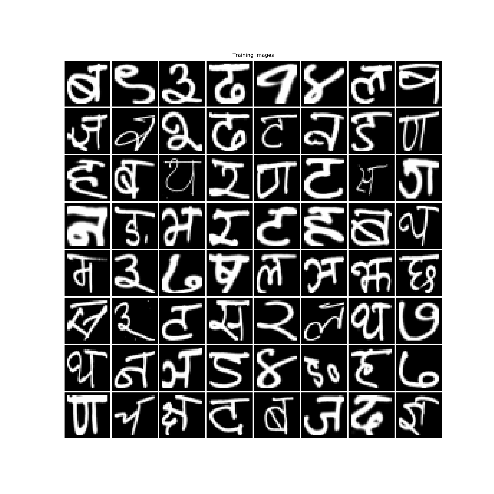
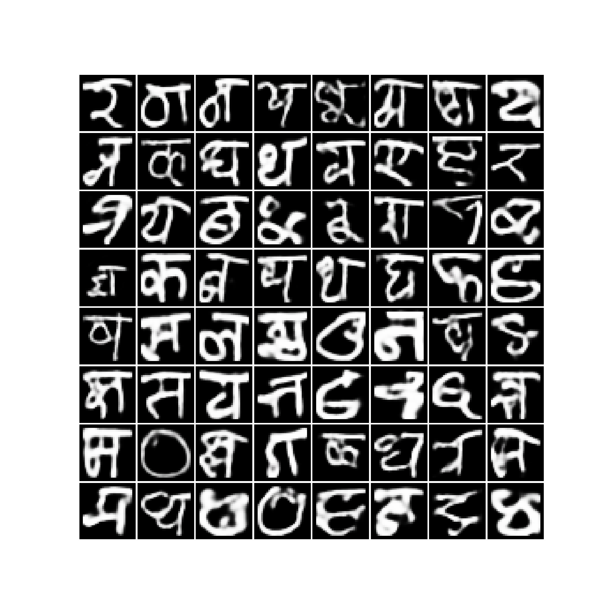
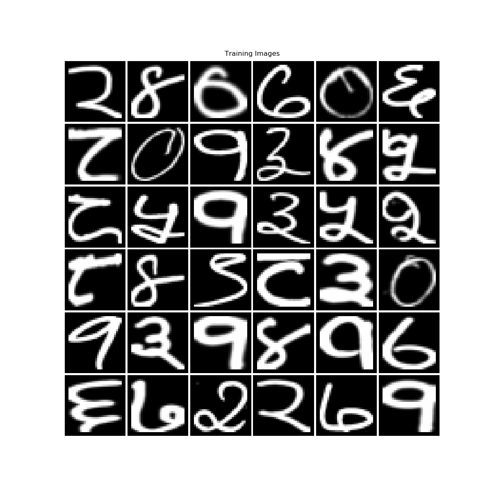
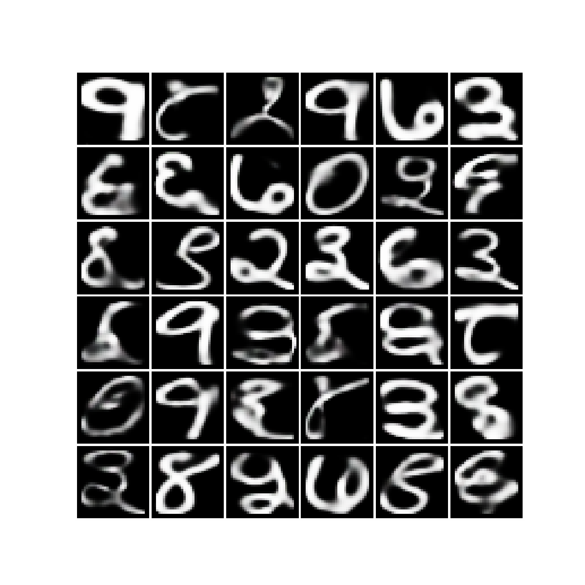

# Generating-Devanagari-Using-DRAW
PyTorch implementation of [DRAW: A Recurrent Neural Network For Image Generation](https://arxiv.org/abs/1502.04623) on the task of generating [Devanagari](https://en.wikipedia.org/wiki/Devanagari) Characters.
<p align="center">

</p>

## Training
Download the data and place it in the **data/** directory. Run **`train.py`** to start training. To change the hyperparameters of the network, update the values in the `param` dictionary in `train.py`.

**Loss Curve**
<p align="center">

</p>

## Generating New Images
To generate new images run **`generate.py`**.
```sh
python3 evaluate.py -load_path /path/to/pth/checkpoint -num_output n
```
The checkpoint file for the model trained for 50 epochs is present in **checkpoint/** directory.

## Results
<table align='center'>
<tr align='center'>
<th> Devanagari Training Data </th>
<th> Generated Devanagari After 50 Epochs</th>
</tr>
<tr>
<td>
<td>
</tr>
</table>
<table align='center'>
<tr align='center'>
<th> Devanagari Only Numbers Training Data </th>
<th> Generated Devanagari Numbers After 50 Epochs</th>
</tr>
<tr>
<td>
<td>
</tr>
</table>

### Some more generated images:


## References
1. **Karol Gregor, Ivo Danihelka, Alex Graves, Danilo Jimenez Rezende, Daan Wierstra** *
DRAW: A Recurrent Neural Network For Image Generation.* [[arxiv](https://arxiv.org/abs/1502.04623)]
2. **ericjang/draw** [[repo](https://github.com/ericjang/draw)]
3. **What is DRAW (Deep Recurrent Attentive Writer)?** [[blog](http://kvfrans.com/what-is-draw-deep-recurrent-attentive-writer/)]

## Data
The Devanagari Character dataset is available on kaggle. ([Source](https://www.kaggle.com/rishianand/devanagari-character-set))
